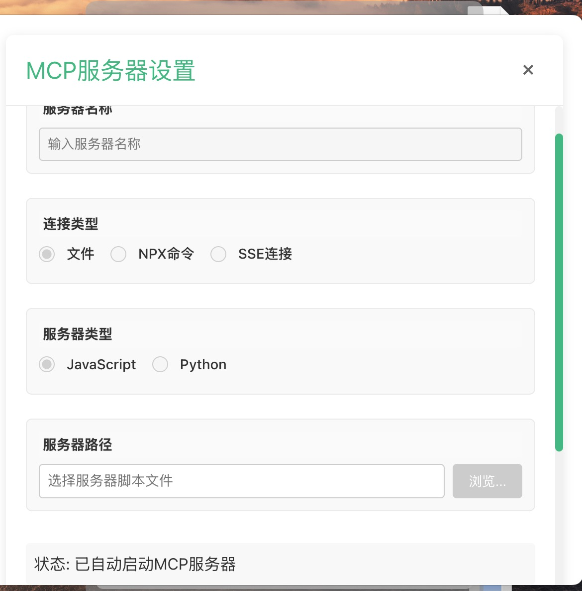
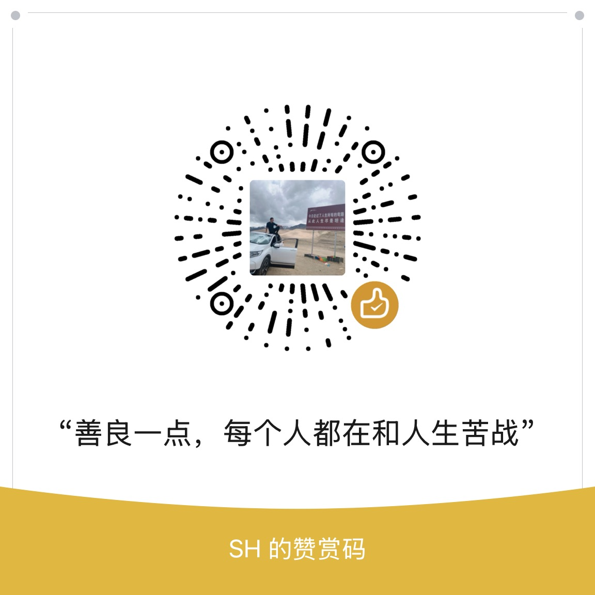

# smart-pet-with-mcp

一个基于MCP协议的智能宠物伴侣应用，通过语音识别和自然语言处理技术，为宠物主人提供实时互动和服务。
该应用是一个MCP-Client应用，可以自主无限搭配MCP-Server实现需求。

<video width="640" height="480" controls src="./resources/show.mp4"></video>



## 功能

- 语音识别：通过麦克风捕获用户语音，并转换为文本。
- 自然语言处理：将语音识别的文本转换为MCP协议格式的指令，发送给MCP服务器。
- GUI界面：提供图形用户界面，方便用户操作和查看信息。
- ...


## 系统架构

- MCP-Client：客户端应用，负责语音识别、自然语言处理和GUI界面。
- MCP-Server：服务器应用，负责接收MCP协议格式的指令，并执行相应的操作。
- FunASR：语音识别引擎，用于语音识别。
- ...
## 开发

### Install

```bash
$ pnpm install
```

### Development

```bash
$ pnpm dev
```

### Build

```bash
# For windows
$ pnpm build:win

# For macOS
$ pnpm build:mac

# For Linux
$ pnpm build:linux
```


## 语音识别采用 FunASR

### 镜像启动
```bash
sudo docker pull \
  registry.cn-hangzhou.aliyuncs.com/funasr_repo/funasr:funasr-runtime-sdk-online-cpu-0.1.12
mkdir -p ./funasr-runtime-resources/models
sudo docker run -p 10096:10095 -it --privileged=true \
  -v $PWD/funasr-runtime-resources/models:/workspace/models \
  registry.cn-hangzhou.aliyuncs.com/funasr_repo/funasr:funasr-runtime-sdk-online-cpu-0.1.12
```
### 服务启动
```bash
cd FunASR/runtime

nohup bash run_server_2pass.sh \
  --model-dir damo/speech_paraformer-large_asr_nat-zh-cn-16k-common-vocab8404-onnx \
  --online-model-dir damo/speech_paraformer-large_asr_nat-zh-cn-16k-common-vocab8404-online-onnx \
  --vad-dir damo/speech_fsmn_vad_zh-cn-16k-common-onnx \
  --punc-dir damo/punc_ct-transformer_zh-cn-common-vad_realtime-vocab272727-onnx \
  --lm-dir damo/speech_ngram_lm_zh-cn-ai-wesp-fst \
  --itn-dir thuduj12/fst_itn_zh \
  --certfile 0 \
  --hotword ../../hotwords.txt > log.txt 2>&1 &
```


## 欢迎大佬提出宝贵的建议和意见，提Issues，会不断进行优化和实现。
## 联系与交流

### 联系作者
- **邮箱**：994129509@qq.com
- **QQ群**：994129509

### 打赏作者
<br/>
<div align="center">
<p>打赏一块钱支持一下作者</p>
<div align="center">
    
</div>
</div>

## 💰 衷心感谢 **大喵哥** 的慷慨打赏！  ¥ 50 元，您每一分钱都不会被辜负。💰    
## 💰 衷心感谢 **蔡从洋Tom** 的慷慨打赏！  ¥ 1 元，您每一分钱都不会被辜负。💰    
## 💰 衷心感谢 **简文斌** 的慷慨打赏！  ¥ 5 元，您每一分钱都不会被辜负。💰    
## 💰 衷心感谢 **加油，支持** 的慷慨打赏！  ¥ 5 元，您每一分钱都不会被辜负。💰    
## 💰 衷心感谢 **Tanix** 的慷慨打赏！  ¥ 5 元，您每一分钱都不会被辜负。💰    
## 💰 衷心感谢 **朱松岭** 的慷慨打赏！  ¥ 5 元，您每一分钱都不会被辜负。💰     
## 💰 衷心感谢 **Victor** 的慷慨打赏！  ¥ 5 元，您每一分钱都不会被辜负。💰    
## 💰 衷心感谢 **kelly** 的慷慨打赏！  ¥ 1 元，您每一分钱都不会被辜负。💰  