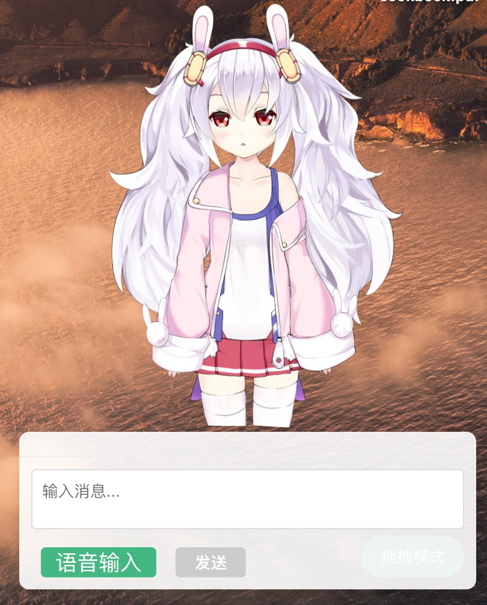

# Smart Pet with MCP

一个基于 MCP（Model Context Protocol）协议的智能宠物伴侣应用，通过语音识别和自然语言处理技术，为宠物主人提供实时互动和服务。该应用是一个 MCP-Client 应用，可以自主无限搭配 MCP-Server 实现需求。

## 项目特点

- 🎯 **智能交互**：通过语音识别和自然语言处理实现智能对话
- 🎨 **精美界面**：采用 Vue3 + Electron 构建的现代化界面
- 🔄 **实时响应**：基于 MCP 协议实现快速响应
- 🐱 **宠物陪伴**：提供虚拟宠物互动体验
- 🌐 **多平台支持**：支持 Windows、macOS 和 Linux 系统

## 技术栈

- **前端框架**：Vue 3 + Electron
- **语音识别**：FunASR
- **协议支持**：MCP (Model Context Protocol)
- **UI 渲染**：Pixi.js
- **数据库**：Better-SQLite3
- **AI 模型**：支持 Anthropic、OpenAI 等大模型

## 功能特性

### 核心功能
- 🎤 **语音识别**：通过麦克风捕获用户语音，并转换为文本
- 🤖 **自然语言处理**：将语音识别的文本转换为 MCP 协议格式的指令
- 💬 **智能对话**：支持与虚拟宠物进行自然语言对话
- 🎮 **交互控制**：支持语音和点击等多种交互方式

### 特色功能
- 🎭 **虚拟形象**：支持 Live2D 虚拟形象展示
- 🌡️ **环境感知**：支持天气和环境信息展示
- 🔄 **实时更新**：支持应用自动更新
- ⚙️ **配置管理**：支持 MCP 服务器配置管理

## 系统架构

```
┌─────────────────┐     ┌─────────────────┐     ┌─────────────────┐
│                 │     │                 │     │                 │
│  Smart Pet App  │────▶│    MCP Client   │────▶│    MCP Server   │
│  (Electron)     │     │                 │     │                 │
│                 │     │                 │     │                 │
└─────────────────┘     └─────────────────┘     └─────────────────┘
        │                       │                       │
        │                       │                       │
        ▼                       ▼                       ▼
┌─────────────────┐     ┌─────────────────┐     ┌─────────────────┐
│                 │     │                 │     │                 │
│  FunASR Engine  │     │  AI Models      │     │  File System    │
│                 │     │                 │     │                 │
└─────────────────┘     └─────────────────┘     └─────────────────┘
```

## 快速开始

### 环境要求
- Node.js >= 16
- pnpm >= 7
- Docker (用于运行 FunASR)

### 安装步骤

1. 克隆项目
```bash
git clone https://github.com/yourusername/smart-pet-with-mcp.git
cd smart-pet-with-mcp
```

2. 安装依赖
```bash
pnpm install
```

3. 启动开发环境
```bash
pnpm dev
```

### 构建应用

```bash
# Windows
pnpm build:win

# macOS
pnpm build:mac

# Linux
pnpm build:linux
```

## FunASR 配置

### 启动 Docker 容器
```bash
sudo docker pull registry.cn-hangzhou.aliyuncs.com/funasr_repo/funasr:funasr-runtime-sdk-online-cpu-0.1.12
mkdir -p ./funasr-runtime-resources/models
sudo docker run -p 10096:10095 -it --privileged=true \
  -v $PWD/funasr-runtime-resources/models:/workspace/models \
  registry.cn-hangzhou.aliyuncs.com/funasr_repo/funasr:funasr-runtime-sdk-online-cpu-0.1.12
```

### 启动 FunASR 服务
```bash
cd FunASR/runtime
nohup bash run_server_2pass.sh \
  --model-dir damo/speech_paraformer-large_asr_nat-zh-cn-16k-common-vocab8404-onnx \
  --online-model-dir damo/speech_paraformer-large_asr_nat-zh-cn-16k-common-vocab8404-online-onnx \
  --vad-dir damo/speech_fsmn_vad_zh-cn-16k-common-onnx \
  --punc-dir damo/punc_ct-transformer_zh-cn-common-vad_realtime-vocab272727-onnx \
  --lm-dir damo/speech_ngram_lm_zh-cn-ai-wesp-fst \
  --itn-dir thuduj12/fst_itn_zh \
  --certfile 0 \
  --hotword ../../hotwords.txt > log.txt 2>&1 &
```

## 贡献指南

欢迎提交 Issue 和 Pull Request 来帮助改进项目。在提交之前，请确保：

1. 代码符合项目的编码规范
2. 提交信息清晰明确
3. 测试覆盖新增功能

## 在线演示

- [视频演示](https://shijianzhong.github.io/7_1744033926.mp4)
- [YouTube](https://www.youtube.com/watch?v=hSaFswzjQ2Q)
- [Bilibili](https://www.bilibili.com/video/BV1irRUYrE4u)
- [抖音](https://www.douyin.com/user/self?from_tab_name=main&modal_id=7490551766623292712)

## 项目截图




## 联系与支持

### 联系方式
- **邮箱**：994129509@qq.com
- **QQ群**：994129509

### 交流群
<div align="center">
    
</div>

### 支持项目
<div align="center">
<p>感谢您的支持！</p>
<div align="center">
    
</div>
</div>

## 特别感谢

感谢以下赞助者的支持：

- 红薯队长 ¥5
- 陆涛 ¥10
- 大喵哥 ¥50
- 蔡从洋Tom ¥1
- 简文斌 ¥5
- 加油，支持 ¥5
- Tanix ¥5
- 朱松岭 ¥5
- Victor ¥5
- kelly ¥1
